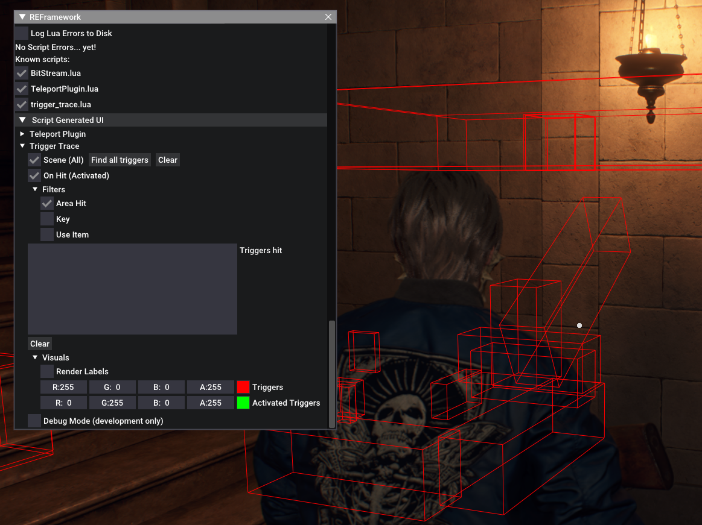

# Trigger Trace
A tool for rendering trigger volumes in Resident Evil 4 (2023).
Originally written to help with speedrun findings.

## Install
1. Install the [REFramework](https://github.com/praydog/REFramework)
2. Clone this repository
3. Move the `trigger_trace.lua` file to `<your_game_install_directory>\reframework\autorun`